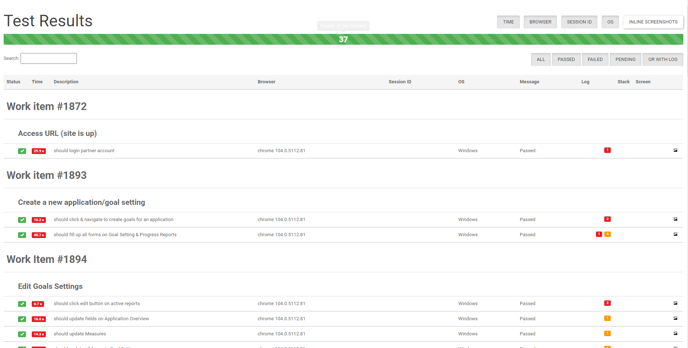
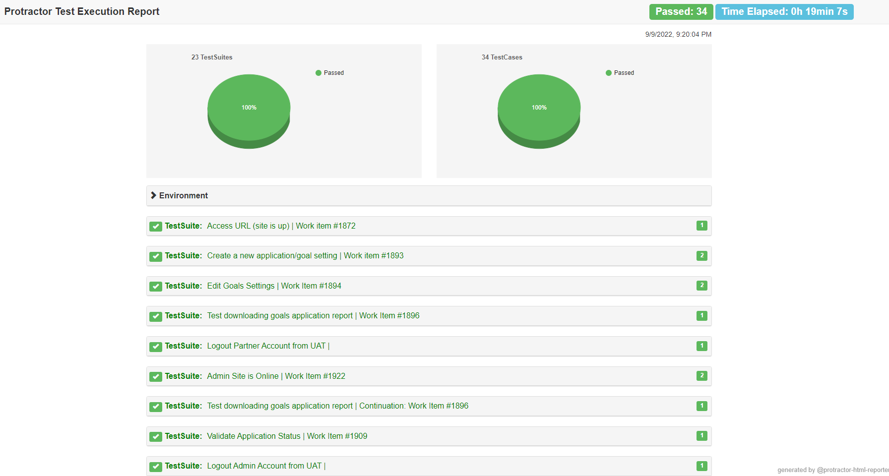
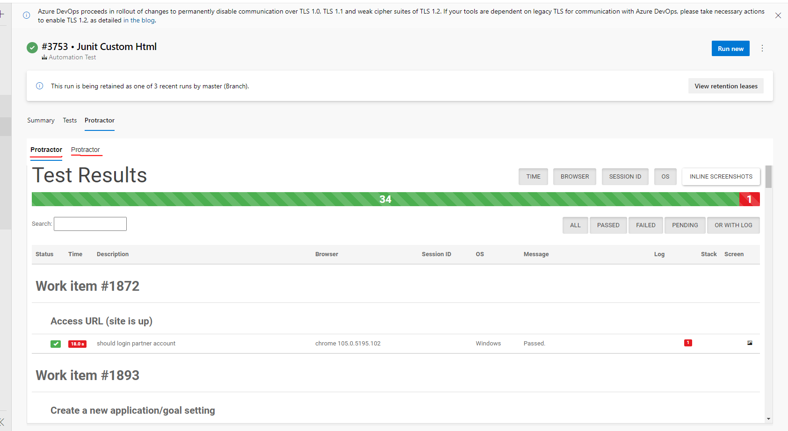

## CIMetrics Automation
Test automation which automatically generates data and migrate to json which consist of fake user login and fake application information used for test purposes.

Development tools used Protractor, Jasmine, JunitXML

## Getting Started
Follow the instructions below to setup the following Test:

1. Open command prompt an run the following:
```
npm install -g protractor
```

2. Run this command to install necessary selenium driver chrome/firefox on your system:
```
webdriver-manager update
```

3. Run this command inside project directory to install required dependencies:
```
npm install
```

4. Run this command to update the project selenium webdriver
```
npm run webdriver-manager-update
```

5. Configure `.env` file and replace url's to your likings:

```
TEST_URL=
```


## Run Test

Use this command to run all test script automation:
```
npm run test
```


## Other Test Commands

Work Item #1872
```
npm run test-login
npm run test-logout
```

Work Item #1873
```
npm run test-register
```

Work Item #1873
```
npm run test-verification
```

Work Item #1891
```
npm run test-admin-manage-user
```

Work Item #1892
```
npm run test-reset-password
```

Work Item #1893
```
npm run test-create-grant-reports
```

Work Item #1894
```
npm run test-create-grant-reports
npm run test-edit-grant-reports
```

Work Item #1896
```
npm run test-download-grant-reports
```

Work Item #1909
```
npm run test-create-grant-reports
npm run test-admin-validate-application
npm run test-submit-due-report
```

Work Item #1923
```
npm run test-admin-reset-user-password
```

Work Item #1924
```
npm run test-admin-confirm-users-email
```

Work Item #1925
```
npm run test-admin-download-completed-report
```

Work Item #1939
```
npm run test
```

Additional Command to run Register, Verification, Login Test Cases:
```
npm run test-partner-registration-verification-login
```


## Test Reports

Navigate to `output` directory and open the `report.html` file with any browser.


## Screenshots





